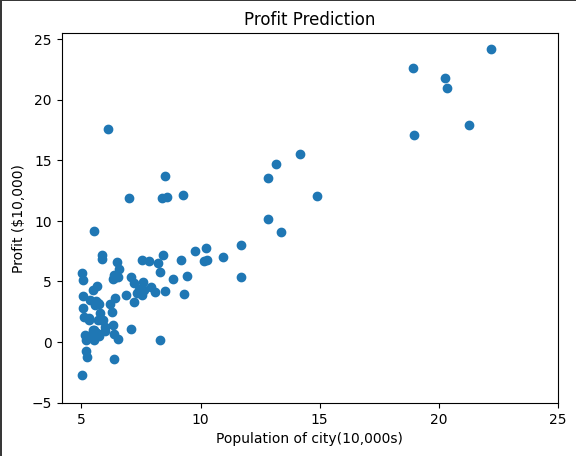
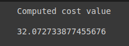
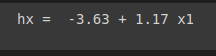
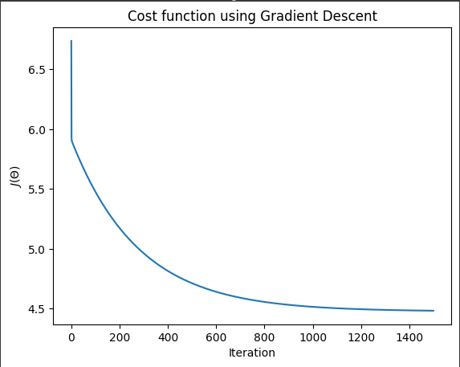
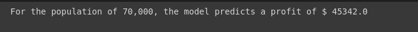

# Implementation-of-Linear-Regression-Using-Gradient-Descent

## Aim:
To write a program to predict the profit of a city using the linear regression model with gradient descent.

## Equipments Required:
1. Hardware – PCs
2. Anaconda – Python 3.7 Installation / Jupyter notebook

## Algorithm:
1. Import the necessary libraries.
2. Define the functions for computeCost and gradient descent.
3. Plot the graphs for cost function and profit prediction.
4. Define the predict function and print the results.

## Program:
```python
/*
Program to implement the linear regression using gradient descent.
Developed by: Sam Israel D
RegisterNumber:  212222230128
*/
```
### Import necessary libraries
```python
import pandas as pd
import numpy as np
import matplotlib.pyplot as plt
```
### Read the csv file
```python
df = pd.read_csv('ex1.txt',header=None)
df
```
### Plot the Profit Prediction Graph
```python
plt.scatter(df[0],df[1])
plt.xticks(np.arange(5,30,step=5))
plt.yticks(np.arange(-5,30,step=5))
plt.xlabel("Population of city(10,000s)")
plt.ylabel("Profit ($10,000)")
plt.title("Profit Prediction")
```
### Define the computeCost function
```python
def computeCost(X,y,theta):
    # Take in a numpy array x,y, theta and generate the cost fucntion of using in a linear regression model
    m = len(y) # lenght of the training data
    h = X.dot(theta) # hypothesis
    square_err = (h-y)**2

    return 1/(2*m) * np.sum(square_err)
```
### Print the value of computeCost
```python
df_n = df.values
m = df_n[:,0].size
X = np.append(np.ones((m,1)),df_n[:,0].reshape(m,1),axis=1)
y = df_n[:,1].reshape(m,1)
theta = np.zeros((2,1))
computeCost(X,y,theta)
```
### Define the gradientDescent Function
```python
def gradientDescent(X,y,theta,alpha,num_iters):

    # Take in numpy array x,y,

    m=len(y)
    j_history=[]

    for i in range(num_iters):
        predictions = X.dot(theta)
        error = np.dot(X.transpose(),(predictions-y))
        descent = alpha * 1/m * error
        theta -= descent
        j_history.append(computeCost(X,y,theta))

    return theta,j_history
```
### Print the value of hypothesis ( h(x) )
```python
theta, j_history = gradientDescent(X,y,theta,0.01,1500)
print("hx = ", str(round(theta[0,0],2)),'+',str(round(theta[1,0],2)),'x1')
```
### Plot the Cost function using Gradient Descent
```python
plt.plot(j_history)
plt.xlabel('Iterations')
plt.ylabel('$J(\Theta)$')
plt.title('Cost function using Gradient Descent')
```
### Plot the Profit prediction graph
```python
plt.scatter(df[0],df[1])
x_value=[x for x in range(25)]
y_value=[y*theta[1]+theta[0] for y in x_value]
plt.plot(x_value,y_value,color="r")
plt.xticks(np.arange(5,30,step=5))
plt.yticks(np.arange(-5,30,step=5))
plt.xlabel("Population of City(10,000s)")
plt.ylabel("Profit ($10,000)")
plt.title("Profit Prediction")
```
### Define the predict function for profit prediction
```python
def predict(x,theta):
  predictions = np.dot(theta.transpose(),x)
  return predictions[0]
```
### Sample prediction 1
```python
predict1 = predict(np.array([1,3.5]),theta)*10000
print("For the population of 35,000, the model predicts a profit of $",str(round(predict1,0)))
```
### Sample Prediction 2
```python
predict2 = predict(np.array([1,7]),theta)*10000
print("For the population of 70,000, the model predicts a profit of $",str(round(predict2,0)))
```


## Output:
### Profit prediction graph

### Computed cost value

### h(x) value

<br>
### Cost function using gradient descent graph

### Profit prediction graph 
.png)
### Profit for the population of 35000

### Profit for the population of 70000



## Result:
Thus the program to implement the linear regression using gradient descent is written and verified using python programming.
